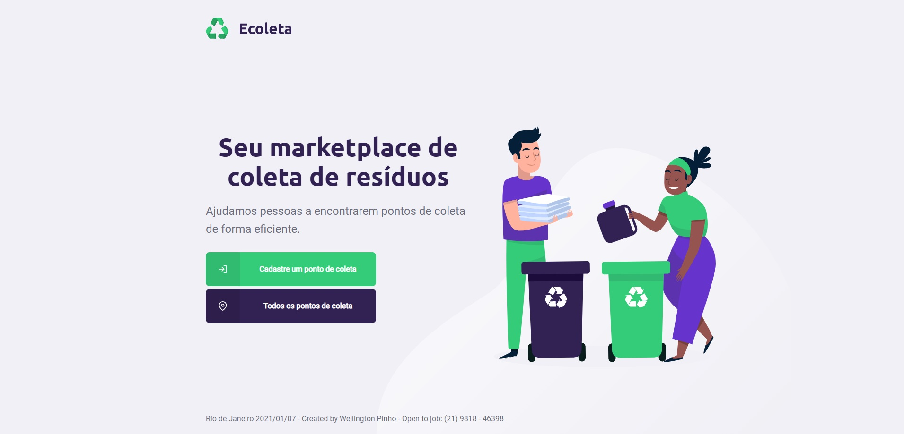

<h3 align="center">
    
    <br><br>
    <b>Projeto para ajudar empresas na coleta de produtos que não devem ser jogados em lixos comuns.</b>  
    <br>
</h3>

<p align="center">
  <a href="https://rocketseat.com.br">
    
  </a>
  <a>
  
</p>

# Índice

- [Índice](#índice)
  - [:bookmark: Sobre](#bookmark-sobre)
  - [:books: Documentação](#books-documentação)
  - [:rocket: Tecnologias Utilizadas](#rocket-tecnologias-utilizadas)
  - [Projeto web](#projeto-web)
  - [Projeto Mobile](#projeto-mobile)
  - [:fire: Como usar](#fire-como-usar)
  - [:recycle: Como contribuir](#recycle-como-contribuir)
  - [:mortar_board: Quem ministrou?](#mortar_board-quem-ministrou)
  - [:memo: License](#memo-license)

<a id="sobre"></a>

## :bookmark: Sobre

O <strong>Ecoleta</strong> é uma aplicação Web e Mobile para ajudar pessoas a encontrarem pontos de coleta para reciclagem.

Essa aplicação foi construída na <strong>Next Level Week</strong> distribuída pela [Rocketseat](https://rocketseat.com.br/). A ideia de criar uma aplicação voltada ao meio ambiente surgiu da coincidência da data do curso e a data da <strong>semana do meio ambiente</strong>

<a id="documentacao"></a>

## :books: Documentação

Alguns trechos de códigos e configurações estão no arquivo **[DOCUMENTAÇÃO](DOCS.md) **TypeScript**, **Node**, **ReactJS** e **React Native**.

<a id="tecnologias-utilizadas"></a>

## :rocket: Tecnologias Utilizadas

O projeto foi desenvolvido utilizando as seguintes tecnologias

- [TypeScript](https://www.typescriptlang.org/)
- [Node.js](https://nodejs.org/en/)
- [ReactJS](https://reactjs.org/)
- [React Native](https://reactnative.dev/)

## Projeto web
<h1 align="center">
    
</h1>

## Projeto Mobile
<h1 align="center">
    
    
</h1>

<a id="como-usar"></a>

## :fire: Como usar

- ### **Pré-requisitos**

  - É **necessário** possuir o **[Node.js](https://nodejs.org/en/)** instalado na máquina
  - O NPM que já vem instalado com NodeJS ou se preferir **[Yarn](https://yarnpkg.com/)**.
  - O **[Expo](https://expo.io/)** instalado de forma global na máquina ou no celular, para fazer simulação do app.

1. Faça um clone :

```sh
  $ git clone https://github.com/wellpinho/ecoleta.git
```

2. Executando a Aplicação:

```sh
  # Instale as dependências
  $ npm i

  ## Crie o banco de dados
  $ cd server
  $ npm run knex:migrate
  $ npm run knex:seed

  # Inicie a API
  $ npm run dev

  # Inicie a aplicação web
  $ cd web
  $ npm start

  # Inicie a aplicação mobile
  $ cd mobile
  $ npm start
```

<a id="como-contribuir"></a>

## :recycle: Como contribuir

- Faça um Fork desse repositório,
- Crie uma branch com a sua feature: `git checkout -b your-name`
- Commit suas mudanças: `git commit -m 'feat: My new feature'`
- Push a sua branch: `git push origin your-name`

## :mortar_board: Quem ministrou?

As aulas foram ministradas pelo mestre **[Diego Fernandes](https://github.com/diego3g)** nas aulas da **Next Level Week**.

## :memo: License

Esse projeto está sob a licença MIT. Veja o arquivo [LICENSE](LICENSE.md) para mais detalhes.

---

<h4 align="center">
    Linkedin: <a href="https://www.linkedin.com/in/wellpinho/" target="_blank">Wellington Pinho</a>
    Portfólio: <a href="https://wellpinho.com.br" target="_blank">`${ Wellington.Pinho }`</a>
</h4>
